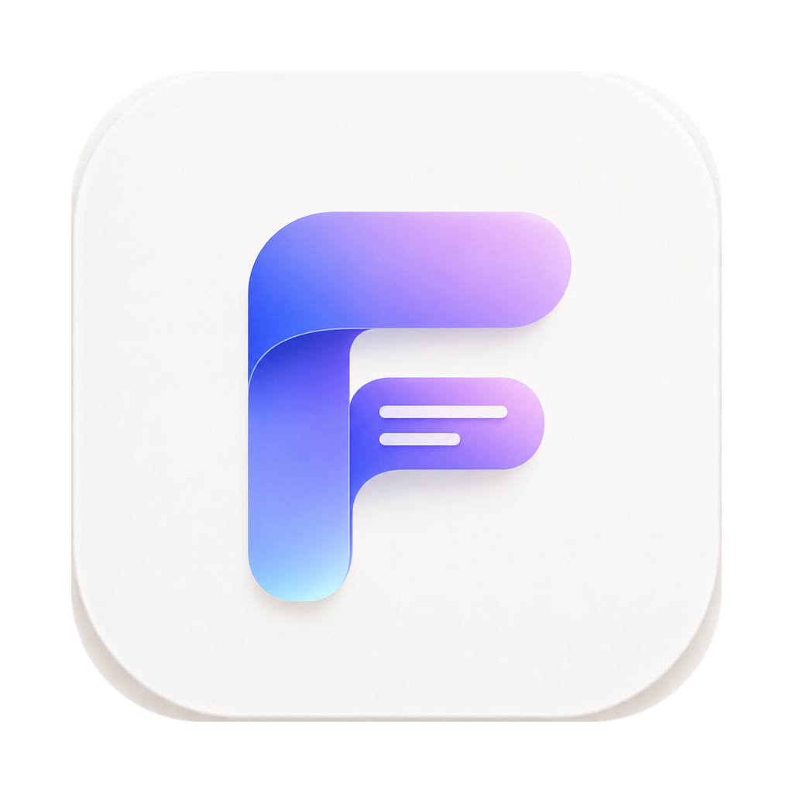

  

<h1 align="center">FinalSub</h1>

  <strong>Ultra-fast, 100% Offline & Privacy-First AI Bilingual Subtitle Creator</strong>

  
  
  
  
  

  🌐 <a href="./README_zh.md">简体中文</a>

  💡 <strong>FinalSub</strong> is a next-generation desktop subtitle editor powered by Tauri 2.0, Rust, and React 19. It breaks through the "dependency hell" of traditional tools by providing a completely self-contained, out-of-the-box experience. From <strong>GPU-accelerated local transcription (ASR)</strong> and <strong>18+ AI translation engines</strong> to <strong>visual proofreading</strong> and <strong>lossless FFmpeg hardsubbing</strong>, FinalSub streamlines your workflow into one seamless pipeline.

---

## 💡 Why FinalSub?

With so many subtitle tools out there, why choose **FinalSub**?

| Dimension | Online SaaS Platforms | Traditional CLI/Python Scripts | 🌟 FinalSub |
| :--- | :--- | :--- | :--- |
| **Privacy & Security** | ❌ Files uploaded to the cloud; risks leaking corporate or personal data | 🟢 Local execution, secure | **🟢 100% local transcription. Zero data leaves your device. Works completely offline.** |
| **Setup Barrier** | 🟢 No installation required | ❌ Requires Python, Conda, Homebrew, and complex path setup. Prone to environment errors | **🟢 Zero dependencies. Built-in pre-signed FFmpeg and Whisper engines. Just extract and run.** |
| **Cost** | ❌ Pay-per-minute or monthly subscriptions. Restrictive limits | 🟢 Free, but has a steep learning curve | **🟢 100% free and open-source. Supports free offline Ollama translation for zero-cost workflows.** |
| **Performance** | 🟢 Cloud-based, friendly to low-end devices | 🟡 High CPU load. GPU acceleration requires complex setup | **🟢 Native macOS Metal & Accelerate acceleration. Near-instant transcription on M-series chips with low heat.** |
| **Pipeline Integration** | 🟡 Transcription only; requires third-party video editors for hardsubbing | ❌ Disjointed scripts; tedious file copying between tools | **🟢 Extraction ➔ Transcription ➔ AI Translation ➔ Proofreading ➔ Hardsubbing, all in one app.** |

---

## ✨ Core Features

### 🎙️ 100% Local Offline ASR (Speech-to-Text)
* **Metal GPU Acceleration**: Powered by `whisper.cpp` with native **Metal** and **Accelerate** hardware acceleration on Apple Silicon (M1/M2/M3/M4). Transcribe a 7-second audio clip in under a second!
* **Smart Model Management**: Place `ggml-*.bin` models of any size into the model directory (with helpful path guides in the UI), and the app will instantly scan and switch between them.
* **Flexible Engines**: Supports Whisper.cpp native inference and provides built-in integration for Parakeet MLX to fit all transcription needs.

### 🤖 18+ AI Translation Engines for Bilingual Subtitles
Translate your transcriptions into elegant, natural bilingual subtitles with the AI model of your choice:
* **LLM Integration**: Supports **DeepSeek (V3/R1)**, **Doubao (Volcano Engine)**, **Gemini**, **Qwen (Tongyi Qianwen)**, **SiliconFlow**, **Azure OpenAI**, and custom OpenAI-compatible endpoints.
* **Zero-Cost Local AI**: Deep integration with **Ollama**. If you run Ollama locally, you can call your local models for high-quality translation completely free of charge—no API key required.
* **Professional Translators**: Access **DeepLX (built-in, keyless, zero-config)**, Microsoft Translator, Google Translate, Baidu, Tencent, Volcano, Xiaoniu, Xunfei, and more.
* **Secure Key Storage**: Uses **macOS Keychain / Windows Credential Manager** to safely encrypt all API keys. Your keys are never stored in plaintext config files or exposed to the frontend.

### ✏️ Interactive Subtitle Proofreader
* Say goodbye to text editors! Built-in subtitle editor designed for efficient editing.
* **Media-Subtitle Linkage**: Subtitle rows highlight dynamically in sync with the video playback.
* **Speedy Editing**: Easily split, merge, and search-and-replace subtitle cards.
* **Timeline Shift**: Adjust time offsets for the entire timeline or selected areas to resolve audio-visual sync issues.

### 🎬 One-Click Lossless Hardsubbing
* Bundled with Universal architecture static high-version `ffmpeg` sidecars. No need to install FFmpeg globally.
* Hardsub generated `SRT` or `VTT` files into original videos in one click.
* Includes presets for font styles and colors, allowing lossless and fast video rendering.

### 📁 Diverse Format Support
* Import and export freely between **SRT**, **VTT**, **ASS**, **LRC (lyrics)**, and **TXT (meeting minutes)**.

---

## 🚀 3 Steps to Subtitle Mastery

### 1. Download & Launch
Go to the [Releases page](https://github.com/GravityPoet/FinalSub/releases), download the installation package (e.g., Mac `.dmg` or Windows equivalent), extract it, and launch.

### 2. Prepare Whisper Models
1. Navigate to the **"Models"** page.
2. Follow the links to download the Whisper models of your choice (e.g., `ggml-base.bin` or `ggml-medium.bin`).
3. Click "Open Model Folder", drop the `.bin` files inside, and hit refresh. The app will auto-detect and load them.

### 3. Create a Subtitle Task
1. Return to the **"Tasks"** page and drop your video or audio file.
2. Select the input language (or choose Auto-detect).
3. (Optional) Turn on translation, then configure and test your chosen AI translation engine.
4. Click **"Start Task"**. Monitor ASR and translation progress in the **"Queue"** page, edit in the **"Proofread"** page, and burn it into the video in the **"Merge"** page!

---

## 🛠️ Modern Tech Stack

FinalSub leverages cutting-edge technology for maximum performance and a tiny memory footprint:
* **Core Framework**: [Tauri 2.0](https://tauri.app/) (Rust-based cross-platform runtime, avoiding Electron's bloat)
* **Frontend**: [React 19](https://react.dev/) + [TypeScript](https://www.typescriptlang.org/)
* **CSS Framework**: [TailwindCSS 4.0](https://tailwindcss.com/)
* **ASR Engine**: [Whisper.cpp](https://github.com/ggerganov/whisper.cpp) (Efficient GGML C/C++ port)
* **Media Processor**: [FFmpeg 7.x](https://ffmpeg.org/) (Pre-signed Universal static Thin Sidecar)
* **Security Backend**: Rust [keyring](https://github.com/hwchen/keyring-rs) crate for system-native Keychain communication

---

## 🔒 Privacy Guarantee

**Your privacy is our priority.**
* **FinalSub is a 100% local client application.**
* Your media files, transcripts, and cached tasks are stored locally on your device and **never uploaded to any third-party servers**.
* Only when you explicitly configure and enable a cloud translation API (like DeepSeek, Gemini, etc.) will the specific subtitle text be securely sent to the official API endpoints. No other network requests are made.

---

## 🤝 Support & Community

**Why Sponsor FinalSub?**

**FinalSub** is built on a simple promise: complete privacy, total tool control, and zero recurring fees. Keeping this project 100% local, free, and open-source requires continuous dedication, and your support directly fuels our journey:
*   **Save on Subscription Fees**: Instead of paying SaaS platforms per minute of transcription or subscribing to expensive monthly plans, FinalSub utilizes your local GPU/CPU. We help content creators and developers save hundreds of dollars annually.
*   **Developer Certification Costs**: To prevent Gatekeeper warnings and provide a seamless "just unzip and run" experience, we dynamically package pre-signed FFmpeg/Whisper binaries. This requires paying ongoing Apple Developer Program fees and maintenance overheads out of pocket.
*   **Backing the Future of Offline AI**: Your donations directly support the research and implementation of next-gen offline local LLM integrations, enhanced VAD algorithms, and keeping this app free of trackers and ads.

If FinalSub has saved your time, protected your data, or simplified your workflow, please consider:
*   🌟 Giving us a **Star** (It really helps boost our visibility!).
*   ☕ **Buying us a coffee** to help offset server, certificate, and device testing costs (please mention your GitHub account).
*   👥 Joining our **WeChat Community** to talk about local ASR and AI translation.

| WeChat Sponsor | WeChat Community | PayPal |
| :---: | :---: | :---: |
|  |  |  |

---

## 🤝 Acknowledgements & Licenses

* **FinalSub**'s early architectural design and some feature concepts were inspired by the excellent open-source project [SmartSub](https://github.com/buxuku/SmartSub) (MIT licensed, Copyright (c) 2024 Lin Xiaodong). We express our sincere gratitude!
* For a full list of third-party licenses, see [THIRD_PARTY_NOTICES.md](./THIRD_PARTY_NOTICES.md).
* This project is licensed under the **MIT License**.

---

> 💡 **Want to learn more about the architecture or build from source?**  
> Check out our 📖 [Developer Guide (docs/DEVELOPMENT.md)](./docs/DEVELOPMENT.md).
