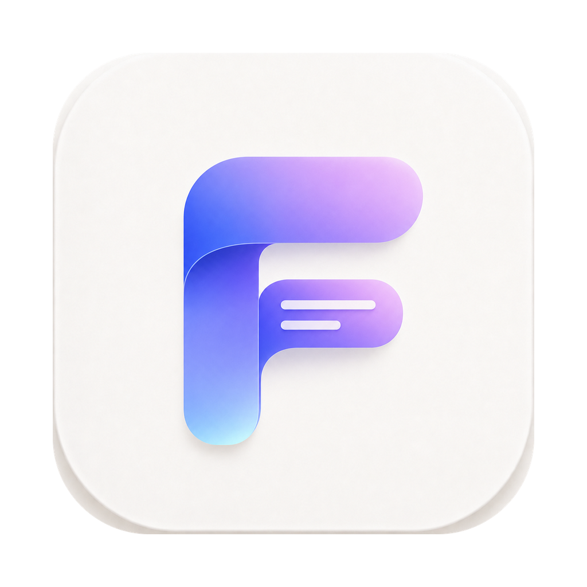

  

<h1 align="center">FinalSub</h1>

  <strong>Ultra-fast, 100% Offline & Privacy-First AI Bilingual Subtitle Creator</strong>

  
  
  
  
  

  🌐 <a href="./README_zh.md">简体中文</a>

  💡 <strong>FinalSub</strong> is a Tauri 2.0 + Rust + React desktop subtitle workstation combining <strong>local-first, optional-cloud transcription</strong>, <strong>18 translation engines</strong>, <strong>visual proofreading</strong>, and <strong>high-quality FFmpeg hardsubbing</strong> in one workflow.

---

## 💡 Why FinalSub?

With so many subtitle tools out there, why choose **FinalSub**?

| Dimension | Online SaaS Platforms | Traditional CLI/Python Scripts | 🌟 FinalSub |
| :--- | :--- | :--- | :--- |
| **Privacy & Security** | ❌ Full media uploaded by default | 🟢 Local execution | **🟢 Local by default; cloud ASR uploads only locally VAD-segmented speech after explicit consent** |
| **Setup Barrier** | 🟢 No local setup | ❌ Often needs Python, Conda, Homebrew, and environment variables | **🟢 Local engines require no Python or uv; FFmpeg and Whisper sidecars ship with the app** |
| **Cost** | ❌ Pay-per-minute or monthly subscriptions. Restrictive limits | 🟢 Free, but has a steep learning curve | **🟢 100% free and open-source. Supports free offline Ollama translation for zero-cost workflows.** |
| **Performance** | 🟢 Cloud compute | 🟡 CPU-heavy or complex GPU setup | **🟢 Whisper.cpp supports macOS Metal; native sherpa-onnx engines run fully offline** |
| **Pipeline Integration** | 🟡 Transcription only; requires third-party video editors for hardsubbing | ❌ Disjointed scripts; tedious file copying between tools | **🟢 Extraction ➔ Transcription ➔ AI Translation ➔ Proofreading ➔ Hardsubbing, all in one app.** |

---

## ✨ Core Features

### 🎙️ Local-First, Optional-Cloud ASR
* **Local engines**: Whisper.cpp, Parakeet TDT, SenseVoice, Paraformer, Qwen3-ASR, and FireRedASR2. Native sherpa-onnx models work offline after installation, and Parakeet needs no Python or uv.
* **Managed models**: In-app downloads with resume, speed/ETA, pinned size and SHA-256 verification, safe extraction, atomic installation, and local import.
* **Cloud protocols**: OpenAI-compatible, ElevenLabs, Deepgram, Gladia, Volcengine, Tencent Cloud, Alibaba Cloud, and iFlytek, with multiple saved configurations. Long audio is segmented locally with Silero VAD and uploaded only after explicit consent. Requests to the same provider endpoint share a configurable cross-task concurrency and start-interval gate.

### 🤖 18+ AI Translation Engines for Bilingual Subtitles
Translate your transcriptions into elegant, natural bilingual subtitles with the AI model of your choice:
* **LLM Integration**: Supports **DeepSeek (V3/R1)**, **Doubao (Volcano Engine)**, **Gemini**, **Qwen (Tongyi Qianwen)**, **SiliconFlow**, **Azure OpenAI**, and custom OpenAI-compatible endpoints.
* **Zero-Cost Local AI**: Deep integration with **Ollama**. If you run Ollama locally, you can call your local models for high-quality translation completely free of charge—no API key required.
* **Professional Translators**: Access **DeepLX (built-in, keyless, zero-config)**, Microsoft Translator, Google Translate, Baidu, Tencent, Volcano, Xiaoniu, Xunfei, and more.
* **Reliable Batch Alignment**: Dynamic JSON Schema locks each cue ID, source-echo similarity detects shifted or merged lines, and FinalSub retries the batch before repairing only the affected cues with neighboring context.
* **Prioritized Glossaries**: Maintain multiple enabled glossaries with deterministic conflict resolution, CSV/TXT import and CSV export. Only terms matched in the current batch are added to the AI prompt.
* **Secure Key Storage**: Secrets are stored in the OS credential store and bound to provider, endpoint, and field. Changing an endpoint never silently reuses its old secret, and secrets are not returned to the frontend over IPC.

### 🧩 Reusable Task Recipes & Review Gates
* Start from built-in offline, bilingual-review, or subtitle-translation recipes, or save, rename, delete, and reapply your own task configuration.
* Recipes persist in the Rust backend. If a referenced local model is removed, FinalSub safely selects an installed model instead of leaving a broken task configuration.
* Enable **human review** to write the subtitle first and hold the task in **Needs Review**. Open the output, check it, then approve one task or an entire selected batch atomically.

### ✏️ Interactive Subtitle Proofreader
* Say goodbye to text editors! Built-in subtitle editor designed for efficient editing.
* **Media-Subtitle Linkage**: Subtitle rows highlight dynamically in sync with the video playback.
* **Speedy Editing**: Easily split, merge, and search-and-replace subtitle cards.
* **Timeline Shift**: Adjust time offsets for the entire timeline or selected areas to resolve audio-visual sync issues.

### 🎬 One-Stop Video Composition
* Bundled with Universal architecture static high-version `ffmpeg` sidecars. No need to install FFmpeg globally.
* **Hard subtitles**: Permanently render `SRT`, `VTT`, or `ASS` into the picture with font, outline, shadow, background, nine-position alignment, CRF, encoding presets, real preview, progress, and cancellation.
* **Soft subtitles**: Package a switchable subtitle track in MKV with language/title metadata while stream-copying video and source audio without quality loss.
* **Dub composition**: Replace source audio, automatically duck and mix it under a dub, or create a switchable source/dub dual-track MKV. Only streams that require processing are re-encoded.

### 📁 Diverse Format Support
* Import and export freely between **SRT**, **VTT**, **ASS**, **LRC (lyrics)**, and **TXT (meeting minutes)**.

### 🔐 Verifiable Updates
* FinalSub can check, download, verify, install, and restart from a signed release manifest. Installation is blocked while subtitle jobs, model operations, or hardsubbing are active. Local builds without the production public key safely fall back to the Releases page.

---

## 🚀 3 Steps to Subtitle Mastery

### 1. Download & Launch
Download the macOS Universal package from the [Releases page](https://github.com/GravityPoet/FinalSub/releases). This repository does not yet publish Windows or Linux installers validated on real machines.

### 2. Prepare Whisper Models
1. Navigate to the **"Models"** page.
2. Choose a model and use the in-app downloader. Downloads can be cancelled and resumed, and managed models are verified before installation.
3. Whisper models can also be installed through local import; the app rescans model status automatically.

### 3. Create a Subtitle Task
1. Return to the **"Tasks"** page and drop your video or audio file.
2. Select the input language (or choose Auto-detect).
3. (Optional) Turn on translation, then configure and test your chosen AI translation engine.
4. Optionally apply/save a task recipe and require human review, then click **"Start Task"**. Monitor ASR and translation in **"Queue"**, approve checked outputs, edit in **"Proofread"**, then use **"Compose"** to choose hard/soft subtitles and the final audio-track structure.

---

## 🛠️ Modern Tech Stack

FinalSub leverages cutting-edge technology for maximum performance and a tiny memory footprint:
* **Core Framework**: [Tauri 2.0](https://tauri.app/) (Rust-based cross-platform runtime, avoiding Electron's bloat)
* **Frontend**: [React 19](https://react.dev/) + [TypeScript](https://www.typescriptlang.org/)
* **CSS Framework**: [TailwindCSS 4.0](https://tailwindcss.com/)
* **ASR Engines**: [Whisper.cpp](https://github.com/ggerganov/whisper.cpp) + [sherpa-onnx](https://github.com/k2-fsa/sherpa-onnx)
* **Media Processor**: [FFmpeg 7.x](https://ffmpeg.org/) (Pre-signed Universal static Thin Sidecar)
* **Security Backend**: Rust [keyring](https://github.com/hwchen/keyring-rs) crate for system-native Keychain communication

---

## 🔒 Privacy Guarantee

**Your privacy is our priority.**
* **FinalSub is a 100% local client application.**
* With local ASR, media, subtitles, and task caches stay on your device.
* Audio is sent only when you configure cloud ASR, grant upload consent, and start a matching task. FinalSub uploads speech chunks produced locally by Silero VAD to the configured endpoint.
* Subtitle text is sent only when you explicitly configure and enable a cloud translation API. For AI translation, only glossary entries matched in the current batch accompany that subtitle text.
* Automatic startup update checks and anonymous crash/error reporting are off by default. FinalSub contacts GitHub Release metadata only when you manually check or enable startup checks; diagnostics are sent to Sentry only after explicit opt-in.

---

## 🤝 Support & Sponsorship

**Why Sponsor FinalSub?**

**FinalSub** is built on a simple promise: complete privacy, total tool control, and zero recurring fees. Keeping this project 100% local, free, and open-source requires continuous dedication, and your support directly fuels our journey:
*   **Save on Subscription Fees**: Instead of paying SaaS platforms per minute of transcription or subscribing to expensive monthly plans, FinalSub utilizes your local GPU/CPU. We help content creators and developers save hundreds of dollars annually.
*   **Ongoing Maintenance & Testing Effort**: To provide a seamless "just unzip and run" experience, we spend significant time and effort compiling multi-architecture sidecars, adapting to different OS updates, and conducting real-device compatibility testing.
*   **Backing the Future of Offline AI**: Your donations directly support the research and implementation of next-gen offline local LLM integrations, enhanced VAD algorithms, and keeping this app free of trackers and ads.

If FinalSub has saved your time, protected your data, or simplified your workflow, please consider:
*   🌟 Giving us a **Star** (It really helps boost our visibility!).
*   ☕ **Buying us a coffee** to support our continuous time and effort spent on maintenance and testing (please mention your GitHub account).

| PayPal | WeChat Sponsor |
| :---: | :---: |
|  |  |

---

## 🤝 Acknowledgements & Licenses

* **FinalSub**'s early architectural design and some feature concepts were inspired by the excellent open-source project SmartSub (MIT licensed, Copyright (c) 2024 Lin Xiaodong). We express our sincere gratitude!
* For a full list of third-party licenses, see [THIRD_PARTY_NOTICES.md](./THIRD_PARTY_NOTICES.md).
* This project is licensed under the **MIT License**.

---

> 💡 **Want to learn more about the architecture or build from source?**  
> Check out our 📖 [Developer Guide (docs/DEVELOPMENT.md)](./docs/DEVELOPMENT.md).
