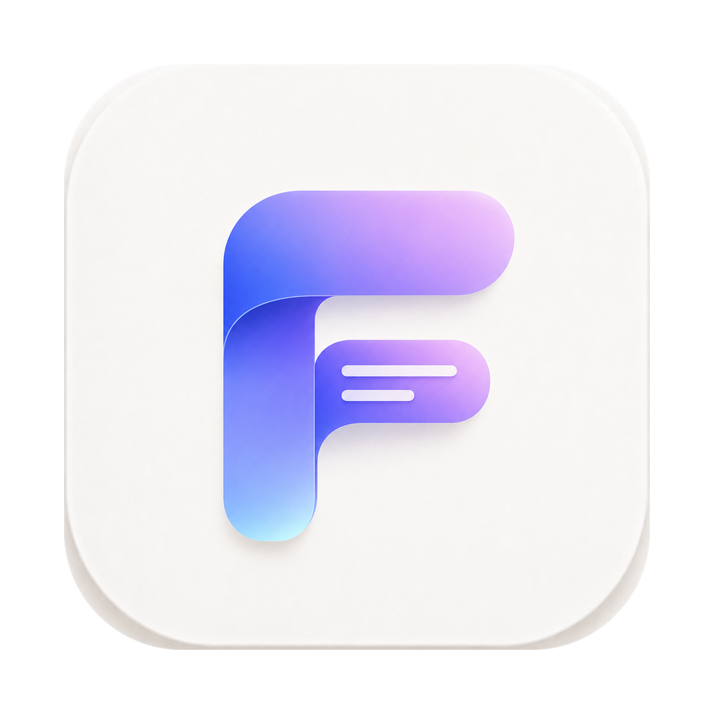

## 🌐 [Click here to switch to: English Version](./README.md)

  

<h1 align="center">FinalSub (中文版)</h1>

  <strong>本地优先的双语字幕与 AI 配音工作站。模型和运行环境准备完成后，本地流程可离线使用；云端服务由你选择。</strong>

  
  
  
  
  

  <a href="./README.md">🇺🇸 English</a> | 🇨🇳 <strong>中文版</strong>

---

### 💡 痛点直击：为什么你需要 FinalSub？

如果你平时需要给视频制作字幕或配音，一定经历过以下折磨：
1. **在线 SaaS 平台套路深**：按分钟收费，免费额度瞬间用光；为了转个几 G 的视频得等半天，甚至还要承担商业机密或未公开视频被泄露的风险。
2. **传统开源脚本门槛高**：需要装 Python、配 Conda 虚拟环境、编译 C++ 库、折腾显卡驱动。普通人配环境折腾一天，最后还是报错。
3. **全链路工具支离破碎**：用工具 A 提取转写，去浏览器翻译，用脚本 B 生成配音，最后还得拖进 Premiere 压制。

**FinalSub 彻底打破了这一切。** 它是一个专门为了终极生产力而生的本地客户端。内置媒体工具，把转写、翻译、校对、配音和合成放进同一个客户端。**应用免费；本地模型需先准备，云端接口按所选服务商规则计费。**

---

### ⚡ 痛点对比：使用 FinalSub 前后的巨大差距

| 😭 使用前（传统方案的惨状） | 😎 使用后（FinalSub 的爽快感） |
| :--- | :--- |
| **SaaS 账单无底洞：** 按分钟转写、翻译计费。重度创作者每个月都要支付数十至数百美金的订阅费。 | **本地处理无按量 API 费用：** 调用本机 GPU/CPU；本地翻译需配合 Ollama，云端服务可选并按服务商规则计费。 |
| **隐私数据裸奔风险：** 商业机密、未公开短片、私人 Vlog 必须上传云端，数据安全完全无法掌握。 | **可选择完整本地流程：** 使用本地转写、Ollama 翻译和本地 TTS 时，素材在设备上处理；使用云端服务时会发送对应音频或文本。 |
| **配置环境的灾难：** 没日没夜地在终端敲代码、装 Python/Homebrew/FFmpeg，只为跑通一个 Whisper 脚本。 | **开箱即用，拒绝折腾：** 内置预编译好的 Universal FFmpeg 和 Whisper 侧载程序，双击即可运行。 |
| **AI 翻译导致字幕错位：** 大语言模型经常胡乱更改行号、丢时间轴，导致双语字幕和音频完全对不上。 | **严格 JSON 架构锁：** 字幕行号物理锁定，结合术语词典自动替换，确保翻译行完美咬合时间轴。 |
| **在数个软件间疲于奔命：** 转写软件、翻译网页、配音脚本、视频剪辑器……来回复制粘贴效率低下。 | **一站式 AI 字幕工作站：** 视频拖入 ➔ 语音转写 ➔ AI 翻译 ➔ 可视化校对 ➔ 自动避让配音 ➔ 视频压制，一气呵成。 |

---

### 🔥 三大杀手级特性（你的本地 AI 字幕超能力）

#### 1. 可离线运行的本地 AI 矩阵 (Mac GPU 硬件加速)
原生支持 Whisper.cpp，完美适配 **macOS Metal GPU 硬件加速**，本地转写速度犹如飞梭。深度集成本地 **Ollama**，你可以一键调用 DeepSeek-R1 或 Qwen 等本地模型进行**零成本大模型翻译**，断网也能输出最信雅达的翻译。支持 Kokoro / VITS / ZipVoice 本地配音引擎，需先准备对应模型。Parakeet MLX 还需 uv 与 Python 依赖；模型页会分别检查权重和运行环境，并提供联网准备、取消和重试入口。

#### 2. 防断流、防错位的 AI 双语翻译与术语库系统
彻底解决传统 LLM 翻译时“幻觉”导致的丢行、丢时间轴问题。FinalSub 通过严格的 JSON Schema 锁定字幕行，结合确定性冲突解决的多术语词典，自动把上下文术语提示注入 prompt。一旦发现翻译偏离，软件会自动对该批次进行重试，只修复受影响的字幕块。

#### 3. 演播室级 FFmpeg 视频合成工作台
从生肉到熟肉，仅需一步。FinalSub 拥有高度整合的音视频联动校对面板，播放与字幕行实时高亮。支持为每行字幕指定不同的 AI 配音演员，生成配音时支持**自动压低原声音量（Duck 混音）**。最后通过内置 FFmpeg 预设，一键无损封软字幕（MKV）或渲染高画质硬字幕（MP4）。

---

### 🚀 60 秒极速上手

没有任何环境门槛，简单到不可思议：

1. **下载安装：** 从 [Releases 页面](https://github.com/GravityPoet/FinalSub/releases) 下载 macOS Universal 安装包，拖入应用程序。
2. **导入素材：** 将需要处理的音视频或已有字幕直接拖入软件。
3. **开始处理：** 选择交付目标，确认语言和字幕内容，点击 **“开始处理”**。

剩下的就交给我们。你可以在队列里实时看到转写和翻译的极速渲染。

Apple Developer ID 分发尚未启用时，macOS 下载包使用 FinalSub 固定自签名证书；每个新下载版本首次启动时，系统可能要求手动确认。请按[自签名 macOS 安装说明](./docs/macos-self-signed-install.md)操作；无需安装根证书，也不要关闭 Gatekeeper。

---

### 🎯 谁最需要这个工具？

- 🎬 **视频博主与内容创作者：** 需要批量翻译出海视频、制作高质量中英双语字幕，希望节省昂贵 SaaS 平台订阅费的创作者。
- 🧑‍💻 **开发者与效率极客：** 希望用最简单的配置实现本地 Whisper 语音转写，并能保存自定义任务配方的工程师。
- 🔐 **对隐私要求极高的专业人士：** 需要处理涉密会议记录、商业采访、法律诉讼等敏感音视频的团队或个人。
- 🎓 **教育工作者与研究员：** 需要将大量英文学术视频、网课翻译成中英双语字幕并配音的学者。

---

### 🛠️ 极其精悍的技术栈

- **桌面框架：** [Tauri 2.0](https://tauri.app/)（基于 Rust 构建，极致省内存，绝不使用臃肿的 Electron）
- **前端界面：** [React 19](https://react.dev/) + [TypeScript](https://www.typescriptlang.org/) + [TailwindCSS 4.0](https://tailwindcss.com/)
- **核心引擎：** [Whisper.cpp](https://github.com/ggerganov/whisper.cpp)（Metal 硬件加速）+ [sherpa-onnx](https://github.com/k2-fsa/sherpa-onnx) + [FFmpeg 7.x](https://ffmpeg.org/)（已签名多架构静态 sidecar）
- **密钥安全：** macOS 使用应用私有的 XChaCha20-Poly1305 加密凭据库，Windows / Linux 使用系统原生凭据服务，安全保存 API Key。

---

### 🔒 隐私承诺

- FinalSub 默认在本地运行。本地处理不会上传音视频或字幕；可选云服务和用户主动开启的错误遥测有各自的数据边界。
- 只有当你主动勾选并使用云端 API（如 Cloud ASR/TTS/AI 翻译）时，对应的音频或文本才会发送到配置的 API 地址；云端 ASR 会先进行本地 VAD 切分，翻译和 TTS 则发送文本。
- macOS 密钥保存在仅当前用户可读的应用私有加密凭据库中，前端 IPC 不回传明文；Windows / Linux 使用系统原生凭据服务。

---

### 🤝 支持与赞助

为了让大家享受“开箱即用”的体验，我们花费了大量心血为各平台编译、签名 Universal 架构的 FFmpeg 和 Whisper 侧载程序，并进行了无数次实机适配测试。如果你觉得 FinalSub 为你节省了时间与资金：

- 🌟 给我们在 GitHub 点个 **Star**（这对我们非常重要！）。
- ☕ **请作者喝杯咖啡**，支持我们持续投入时间精力进行维护和测试！

| PayPal 收款码 | 微信赞助码 |
| :---: | :---: |
|  |  |

---

### ⚖️ 开源协议与鸣谢

- 本项目在早期架构与设计上，从优秀开源项目 [SmartSub](https://github.com/buxuku/SmartSub)（基于 MIT 协议，版权所有 (c) 2024 Lin Xiaodong）中汲取了许多宝贵灵感，特此表达诚挚的谢意！
- 第三方开源依赖及版权声明见 [THIRD_PARTY_NOTICES.md](./THIRD_PARTY_NOTICES.md)。
- 本项目基于 **MIT 协议** 开放源代码。
